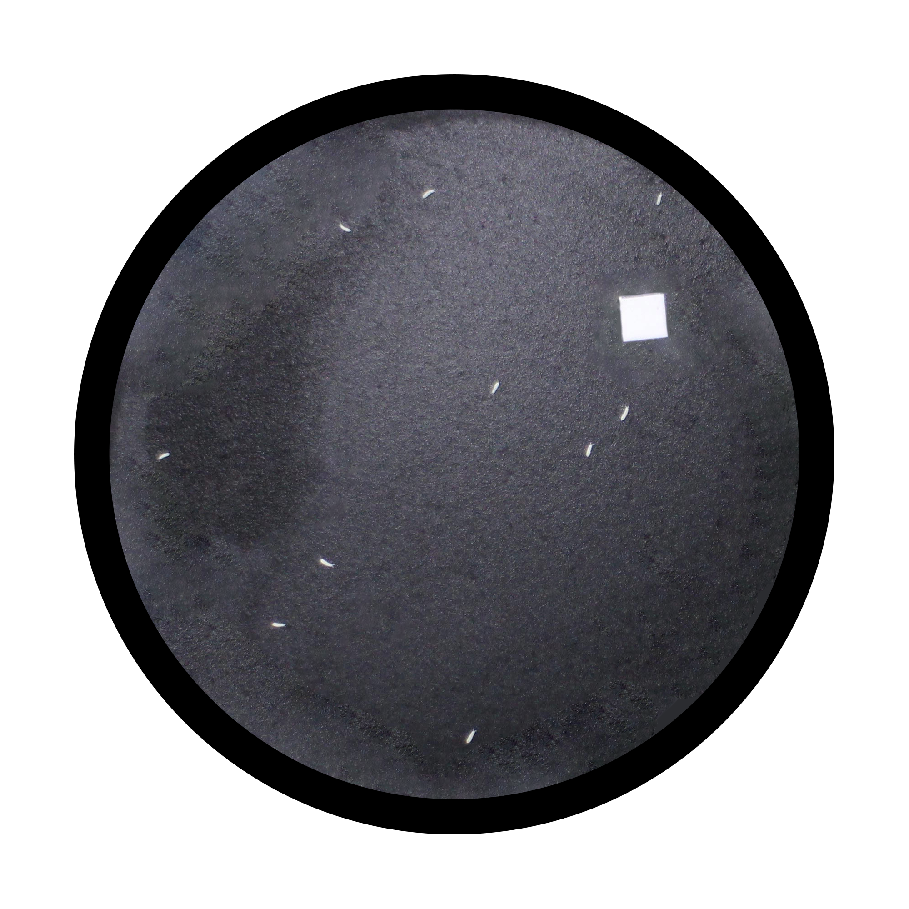
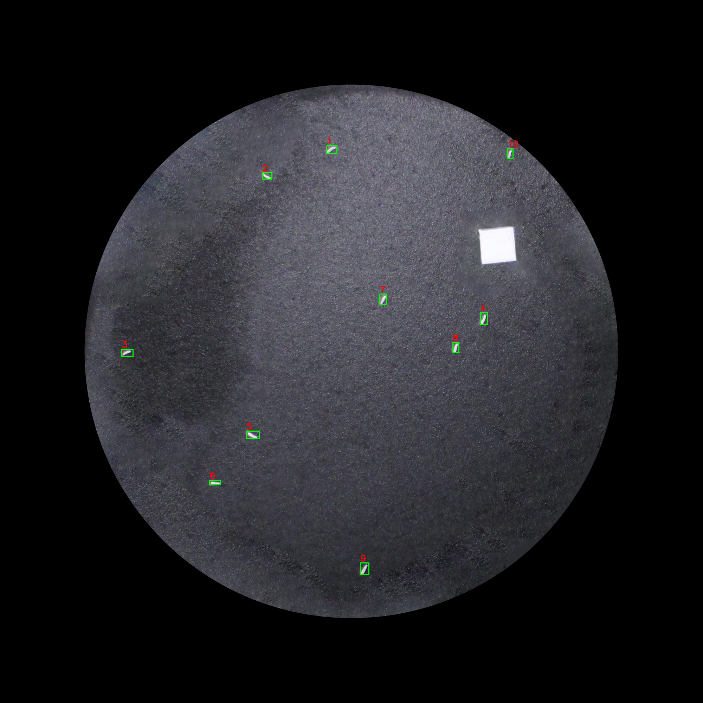

# alkimi-size

This repository contains the official implementation for the paper: **"Coupling deep-learning detection with body-area measurement and cohort analysis for comprehensive soil ecotoxicity assessment of the springtail Allonychiurus kimi"**.

The software provides an automated pipeline to detect *Allonychiurus kimi* (soil springtails), filter the primary subjects, and accurately measure their body area ($mm^2$) using GPU-accelerated image segmentation. This version is specifically optimized for **reproducibility** and verification during the peer-review process.

---

## 🛠 Requirements & Installation

This project is built to run seamlessly inside a **Docker root environment**. It relies on `pyclesperanto_prototype` for GPU-accelerated processing, which requires OpenCL compatibility.

### 1. Prerequisites
Ensure you have Docker and the necessary GPU drivers installed on your host machine.

### 2. Standard Installation
Clone the repository and install the required dependencies:

```bash
git clone [https://github.com/HAI-at-Ewha/alkimi-size.git](https://github.com/HAI-at-Ewha/alkimi-size.git)
cd alkimi-size
pip install -r requirements.txt
```

## 📁 Repository Structure

```text
alkimi-size/
├── data/
│   └── upload/                # Placeholder directory for raw input images/datasets
│   └── preprocessed/          # (Automatically Generated) Default placeholder directory for preprocessed images/datasets
│   └── detection/             # (Automatically Generated) Default placeholder directory for artifacts of detection model
│   └── segmentation/          # (Automatically Generated) Default placeholder directory for artifacts of segmentation module
├── model/
│   └── detector_adult.pt      # Pre-trained YOLO model checkpoint for adult detection
│   └── detector_juvenile.pt   # Pre-trained YOLO model checkpoint for juvenile detection
├── pipeline.ipynb             # Main Jupyter Notebook containing the full pipeline
├── requirements.txt           # Python dependencies matched to the Docker root env
└── README.md                  # Project documentation
```
💡 **Note**: Place your raw source images into the data/upload/ directory before running the pipeline. Generated outputs (detection/) will automatically replicate this directory structure during execution.

## 🚀 Usage Guide
The entire workflow is contained within a single, sequential Jupyter Notebook (pipeline.ipynb). You can run the pipeline by executing the cells step-by-step:

### Step 1: Preprocessing & Transparency Removal
Converts input PNG images, masks out transparent areas (alpha channel) to solid black, and replicates the original directory structure into target paths.
  * Function: preprocessing\_images(base\_path, target\_path)

### Step 2: YOLO Detection & Box Localization
Loads the pre-trained YOLO model (model/detector_{adult|juvenile}.pt), runs inference on the preprocessed images, generates crop coordinates, and draws labeled bounding boxes for verification.
  * Key Hyperparameters: conf=0.05, imgsz=1280, iou=0.30
  
### Step 3: Voronoi-Otsu Segmentation & Body-Area Measurement
Applies GPU-accelerated Voronoi-Otsu labeling via pyclesperanto to segment the detected springtails. It automatically calculates the Euclidean distance to find the primary subject closest to the image center and computes its precise body surface area ($mm^2$).
  * Function: segmentation()

## 📊 Screenshots
### Raw Image
<p align="center">
  
</p>

### Detected Image
<p align="center">
  
</p>

### Segmentation & Body-Area Measurement
<p align="center">
  
</p>

## ⚖ License
This project is licensed under the MIT License - see the full license terms for details. It allows free use, modification, and distribution, provided that the original copyright notice is included, and carries no warranty.
